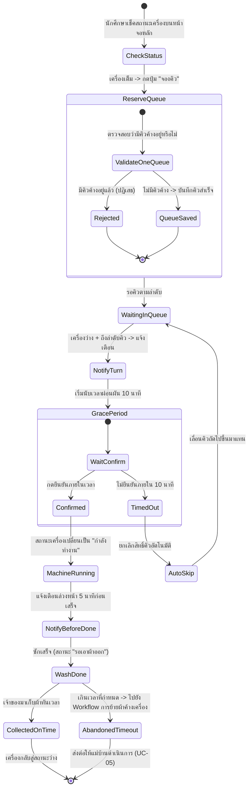
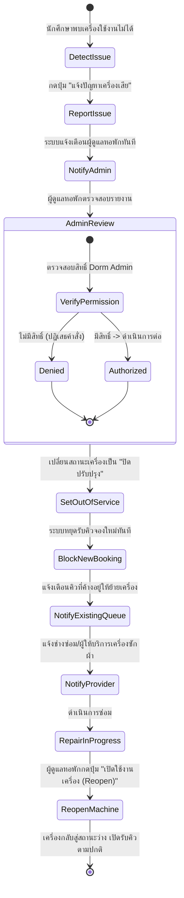

# 06 — Requirement Models: User Stories, Use Cases and Acceptance Criteria

**Course:** ENGSE206 Software Engineering Studio
**Case:** Dorm Laundry Queue and Status (Case-03)
**Deliverable:** Week 06 — Requirement Models and Negotiation
**Source Baseline:** docs/01-problem-brief.md (v0.1) & docs/05-requirement-backlog.md (v1.0, Approved)
**Status:** Modeled & Validated
**Version:** 1.0
**Date:** 2026-08-18

---

## 1. User Stories

ตารางความต้องการในรูปแบบ User Story ครอบคลุมผู้ใช้งานทุกบทบาท (นักศึกษาหอพัก, ผู้ดูแลหอพัก, แม่บ้าน/เจ้าหน้าที่พื้นที่) และจัดลำดับตาม MoSCoW โดยอ้างอิงจาก Requirement Backlog v1.0 และตาราง Role–Goal–Value ที่ทีมระดมความคิดไว้

| ID | Actor | Goal | Value | Requirement | Priority | Acceptance Criteria |
|----|-------|------|-------|--------------|----------|----------------------|
| US-01 | นักศึกษาหอพัก | เห็นสถานะความว่างและจำนวนคิวรอจริงของเครื่องซัก/อบผ้าแต่ละเครื่องแบบเรียลไทม์ | วางแผนเวลาซักผ้าได้ถูก โดยไม่ต้องเดินลงไปดูให้เสียเที่ยว | FR-01, NFR-03 | Must | AC-01 |
| US-02 | นักศึกษาหอพัก | กดจองคิวเครื่องซักผ้าล่วงหน้าผ่านสมาร์ตโฟนได้ (คนละไม่เกิน 1 คิว) | ได้รับความยุติธรรมตามลำดับ ไม่ต้องเถียงกันว่าใครมาก่อนหรือกั๊กคิวด้วยตะกร้า | FR-02, BR-01 | Must | AC-02 |
| US-03 | นักศึกษาหอพัก | เห็นคิวบนหน้าจอสาธารณะแสดงเป็นรหัสคิวหรือนามแฝงแทนชื่อจริง/เลขห้อง | ตรวจสอบได้ว่าไม่มีใครแซงคิว โดยที่ข้อมูลส่วนตัวยังปลอดภัย | NFR-01, BR-04 | Must | AC-03 |
| US-04 | นักศึกษาหอพัก | ให้ระบบยกเลิกสิทธิ์คิวโดยอัตโนมัติหากไม่มายืนยันตัวตนภายใน 10 นาทีหลังถึงคิว | ไม่ให้คิวค้างและคนถัดไปได้ใช้เครื่องต่อโดยไม่ต้องรอเก้อ | FR-03, BR-02 | Must | AC-04 |
| US-05 | นักศึกษาหอพัก | ได้รับการแจ้งเตือนล่วงหน้า 5 นาทีก่อนซักเสร็จ และเมื่อถึงคิวของตัวเอง | รีบมาเก็บผ้าได้ทันเวลา และไม่ให้ผ้าค้างในเครื่องจนกระทบคิวคนถัดไป | FR-04 | Must | AC-05 |
| US-06 | นักศึกษาหอพัก | กดรายงานเครื่องเสียผ่านระบบได้ทันทีที่พบปัญหา | ให้ผู้ดูแลหอพักและช่างซ่อมรับทราบและดำเนินการได้เร็ว โดยไม่มีใครมาหยอดเหรียญซ้ำในเครื่องที่เสีย | FR-05 | Must | AC-06 |
| US-07 | ผู้ดูแลหอพัก | เปลี่ยนสถานะเครื่องเป็น "ปิดปรับปรุง (Out of Service)" ได้ทันทีเมื่อได้รับแจ้งเครื่องเสีย และเปิดกลับมาใช้งานได้เมื่อซ่อมเสร็จ | ให้ระบบหยุด/เปิดรับคิวจองเครื่องนั้นให้ตรงกับสภาพจริง | FR-05, BR-03 | Must | AC-06 |
| US-08 | แม่บ้าน/เจ้าหน้าที่พื้นที่ | บันทึกตำแหน่งที่ย้ายผ้าค้างเครื่องไปวางไว้ในระบบ (เช่น Shelf A, Basket B) พร้อมเวลา | ให้นักศึกษาเจ้าของผ้าตามหาผ้าของตัวเองได้เอง โดยไม่ต้องมาถามป้าแม่บ้านทีละคน | FR-06 | Should | AC-07 |
| US-09 | ผู้ดูแลหอพัก | ดูแดชบอร์ดสรุปสถิติการใช้งานและรายงานเครื่องที่ชำรุดบ่อยย้อนหลัง | วางแผนซ่อมบำรุงและจัดสรรทรัพยากรได้อย่างเหมาะสม | FR-07 | Could | AC-08 |
| US-10 | นักศึกษาหอพักที่ใช้งานผ่านมือถือ | ใช้งานระบบผ่านหน้าจอที่ออกแบบ Mobile-first และเช็คสถานะ/จองคิวได้ภายในไม่เกิน 3 คลิก แม้สัญญาณอินเทอร์เน็ตใต้หอพักไม่ค่อยดี | ทำธุระเรื่องซักผ้าให้เสร็จได้อย่างรวดเร็วโดยไม่ติดขัด | NFR-02, F-04 | Must | AC-09 |

---

## 2. Acceptance Criteria

เกณฑ์การยอมรับเขียนด้วยรูปแบบ Given-When-Then (Gherkin format) ครอบคลุมทั้งกรณีทำงานปกติ (Positive), กรณีตรวจสอบความถูกต้อง (Validation), ความเป็นส่วนตัว (Privacy) และกรณีเกิดข้อผิดพลาด (Negative)

### AC-01 — การแสดงสถานะเครื่องซัก/อบผ้าแบบเรียลไทม์ (Real-time Machine Status)
เชื่อมโยง: FR-01, NFR-03, US-01

**Scenario 1.1: แสดงสถานะและจำนวนคิวรอถูกต้อง (Success)**
```
Given นักศึกษาหอพักเปิดหน้าจอหลักของระบบ
When ระบบดึงข้อมูลสถานะเครื่องซัก/อบผ้าทุกเครื่องในอาคาร
Then ระบบต้องแสดงสถานะของแต่ละเครื่อง (ว่าง / กำลังทำงาน / ซักเสร็จรอเอาผ้าออก / ปิดปรับปรุง)
  พร้อมจำนวนคิวรอที่ตรงกับข้อมูลจริงในฐานข้อมูล
```

**Scenario 1.2: อัปเดตสถานะล่าช้าเกินกำหนด (Performance/Negative)**
```
Given มีการเปลี่ยนแปลงสถานะเครื่องในฐานข้อมูล (เช่น เครื่องซักเสร็จ)
When ระบบพยายาม sync สถานะไปยังหน้าจอผู้ใช้
Then ค่าความล่าช้า (Latency) ในการอัปเดตหน้าจอต้องไม่เกิน 3 วินาที
And หากอัปเดตไม่สำเร็จ ระบบต้องแสดงข้อความ "ไม่สามารถโหลดสถานะล่าสุดได้ กรุณารีเฟรช" แทนการแสดงข้อมูลเก่าโดยไม่แจ้งเตือน
```

### AC-02 — การจองคิวเครื่องซักผ้า (Queue Reservation)
เชื่อมโยง: FR-02, BR-01, US-02

**Scenario 2.1: จองคิวสำเร็จเมื่อเครื่องเต็ม (Success)**
```
Given เครื่องซักผ้าที่นักศึกษาต้องการใช้กำลังทำงานอยู่ (สถานะไม่ว่าง)
And นักศึกษายังไม่มีคิวค้างอยู่ในระบบ
When นักศึกษากดปุ่ม "จองคิว" สำหรับเครื่องนั้น
Then ระบบต้องบันทึกคิวของนักศึกษาต่อท้ายลำดับ และแสดงหมายเลขลำดับคิวที่ชัดเจน
```

**Scenario 2.2: พยายามจองคิวซ้ำเกิน 1 คิวต่อบัญชี (Validation/Negative)**
```
Given นักศึกษามีคิวที่กำลังรออยู่แล้ว 1 คิวในระบบ
When นักศึกษาพยายามกดจองคิวเครื่องอื่นเพิ่มอีก 1 คิว
Then ระบบต้องปฏิเสธการจองใหม่
And แสดงข้อความ "คุณมีคิวที่กำลังรออยู่แล้ว สามารถจองได้เพียง 1 คิวต่อบัญชี"
```

### AC-03 — การปกปิดข้อมูลส่วนบุคคลบนหน้าจอคิวสาธารณะ (Anonymized Public Queue Display)
เชื่อมโยง: NFR-01, BR-04, US-03

**Scenario 3.1: หน้าจอคิวสาธารณะแสดงรหัสคิวแทนชื่อจริง**
```
Given มีนักศึกษาหลายคนอยู่ในคิวของเครื่องซักผ้าเครื่องเดียวกัน
When หน้าจอคิวสาธารณะ (Public Dashboard) แสดงรายการลำดับคิว
Then ระบบต้องแสดงเพียงรหัสคิว (เช่น Q-01, Q-02) โดยไม่ปรากฏชื่อจริง นามสกุล เลขห้องพัก หรือเบอร์โทรศัพท์
```

**Scenario 3.2: เจ้าของคิวเห็นข้อมูลของตนเองเท่านั้นในมุมมองส่วนตัว**
```
Given นักศึกษาเข้าสู่ระบบด้วยบัญชีของตนเอง
When นักศึกษาเปิดหน้า "คิวของฉัน"
Then ระบบแสดงลำดับคิวและรหัสคิวของตนเองแบบเต็ม แต่ยังคงไม่แสดงข้อมูลส่วนตัวของผู้ใช้คนอื่นในคิวเดียวกัน
```

### AC-04 — การยกเลิกคิวอัตโนมัติเมื่อไม่มายืนยัน (No-show Timeout)
เชื่อมโยง: FR-03, BR-02, US-04

**Scenario 4.1: ข้ามคิวอัตโนมัติเมื่อเกิน 10 นาที**
```
Given นักศึกษาถึงลำดับคิวของตนเองแล้ว และระบบส่งแจ้งเตือนไปแล้ว
When นักศึกษาไม่กดยืนยันเริ่มใช้งานภายใน 10 นาทีนับจากเวลาที่แจ้งเตือน
Then ระบบต้องยกเลิกสิทธิ์คิวของนักศึกษาคนนั้นโดยอัตโนมัติ
And เลื่อนคิวของผู้ใช้ลำดับถัดไปขึ้นมาแทนทันที
```

**Scenario 4.2: นักศึกษายืนยันทันเวลา (Success)**
```
Given นักศึกษาถึงลำดับคิวและได้รับแจ้งเตือนแล้ว
When นักศึกษากดปุ่ม "ยืนยันเริ่มใช้งาน" ภายใน 10 นาที
Then ระบบต้องเปลี่ยนสถานะเครื่องเป็น "กำลังทำงาน" และผูกกับบัญชีของนักศึกษาคนนั้น
```

### AC-05 — การแจ้งเตือนอัตโนมัติ (Automated Notification)
เชื่อมโยง: FR-04, US-05

**Scenario 5.1: แจ้งเตือนก่อนซักเสร็จ 5 นาที**
```
Given มีเครื่องซักผ้าที่กำลังทำงานและใกล้ครบรอบเวลาซัก
When เหลือเวลาอีก 5 นาทีก่อนซักเสร็จ
Then ระบบต้องส่งการแจ้งเตือนไปยังเจ้าของรอบซักนั้นโดยอัตโนมัติ
```

**Scenario 5.2: แจ้งเตือนเมื่อถึงคิว**
```
Given มีนักศึกษาอยู่ในลำดับคิวถัดไปของเครื่องที่เพิ่งว่าง
When เครื่องเปลี่ยนสถานะเป็นว่างและถึงลำดับของนักศึกษาคนนั้น
Then ระบบต้องส่งการแจ้งเตือนทันที และเริ่มนับเวลาผ่อนผัน (Grace Period) 10 นาทีคู่ขนานกัน
```

### AC-06 — การรายงานและจัดการสถานะเครื่องเสีย (Machine Issue Reporting & Status Management)
เชื่อมโยง: FR-05, BR-03, US-06, US-07

**Scenario 6.1: นักศึกษารายงานเครื่องเสีย (Success)**
```
Given นักศึกษาพบว่าเครื่องซักผ้าเครื่องหนึ่งใช้งานไม่ได้
When นักศึกษากดปุ่ม "แจ้งปัญหาเครื่องเสีย" และเลือกอาการที่พบ
Then ระบบต้องบันทึกรายงานปัญหา พร้อมส่งการแจ้งเตือนไปยังผู้ดูแลหอพักทันที
```

**Scenario 6.2: ผู้ดูแลหอพักปิดรับคิวเครื่องที่ชำรุด (Authorized Action)**
```
Given มีรายงานเครื่องเสียเข้ามาในระบบ
When ผู้ดูแลหอพักเข้าสู่ระบบด้วยสิทธิ์ Dorm Admin และกดเปลี่ยนสถานะเครื่องเป็น "ปิดปรับปรุง (Out of Service)"
Then ระบบต้องหยุดรับการจองคิวใหม่สำหรับเครื่องนั้นทันที
And คิวที่ค้างอยู่ก่อนหน้าได้รับแจ้งเตือนว่าเครื่องขัดข้อง พร้อมตัวเลือกย้ายไปเครื่องอื่น
```

**Scenario 6.3: ผู้ใช้ทั่วไปพยายามเปลี่ยนสถานะเครื่อง (Access Control/Negative)**
```
Given นักศึกษาทั่วไป (ไม่มีสิทธิ์ Dorm Admin) เข้าสู่ระบบ
When นักศึกษาพยายามเรียกใช้ฟังก์ชันเปลี่ยนสถานะเครื่องเป็น "ปิดปรับปรุง"
Then ระบบต้องปฏิเสธคำสั่งและแสดงข้อความ "คุณไม่มีสิทธิ์ดำเนินการนี้"
```

### AC-07 — การบันทึกตำแหน่งผ้าค้างเครื่อง (Abandoned Laundry Relocation Log)
เชื่อมโยง: FR-06, US-08

**Scenario 7.1: แม่บ้านบันทึกตำแหน่งย้ายผ้าสำเร็จ**
```
Given เครื่องซักผ้าซักเสร็จแล้วแต่เจ้าของไม่มานำผ้าออกเกินเวลาที่กำหนด
When แม่บ้านย้ายผ้าไปวางไว้ที่จุดกลาง แล้วบันทึกหมายเลขเครื่องและตำแหน่งที่วาง (เช่น Shelf A) พร้อมเวลาลงระบบ
Then ระบบต้องบันทึกข้อมูลตำแหน่งผ้าและผูกกับหมายเลขเครื่องนั้น
And เจ้าของผ้า (ถ้าระบบทราบบัญชีผู้จอง) ได้รับการแจ้งเตือนตำแหน่งที่ผ้าถูกย้ายไป
```

### AC-08 — แดชบอร์ดสถิติการใช้งานและเครื่องชำรุดบ่อย (Usage & Maintenance Dashboard)
เชื่อมโยง: FR-07, US-09

**Scenario 8.1: แสดงรายงานย้อนหลังสำหรับผู้ดูแลหอพัก**
```
Given มีข้อมูลประวัติการใช้งานและการแจ้งซ่อมสะสมอยู่ในระบบ
When ผู้ดูแลหอพักเปิดหน้าแดชบอร์ด
Then ระบบต้องแสดงกราฟช่วงเวลาที่มีการใช้งานหนาแน่น และรายชื่อเครื่องที่มีประวัติแจ้งซ่อมบ่อยที่สุดย้อนหลัง
```

### AC-09 — การใช้งานบนมือถือแบบ Mobile-first (Mobile Usability)
เชื่อมโยง: NFR-02, US-10

**Scenario 9.1: เช็คสถานะ/จองคิวสำเร็จภายในไม่เกิน 3 คลิก**
```
Given นักศึกษาเปิดระบบผ่านเบราว์เซอร์บนสมาร์ตโฟน
When นักศึกษาต้องการตรวจสอบสถานะเครื่องและจองคิว
Then ผู้ใช้ต้องสามารถดำเนินการสำเร็จ (เห็นสถานะ และกดจองคิว) ได้ภายในไม่เกิน 3 คลิกจากหน้าแรก
And หน้าจอต้องจัดวางองค์ประกอบในแนวตั้งโดยไม่มีการล้นหน้าจอด้านข้าง (Horizontal Scroll)
```

---

## 3. Use Case List

| UC | Use Case | Primary Actor | Requirements | Level |
|----|----------|----------------|---------------|-------|
| UC-01 | Check Machine Status & Queue (ตรวจสอบสถานะเครื่องและคิว) | นักศึกษาหอพัก (Resident Student) | FR-01, NFR-01, BR-04 | Summary/Partial |
| UC-02 | Reserve Queue & Manage Queue Lifecycle (จองคิวและจัดการวงจรคิว) | นักศึกษาหอพัก (Resident Student) | FR-02, FR-03, FR-04, BR-01, BR-02 | Detailed/Core |
| UC-03 | Report Machine Malfunction (แจ้งเครื่องเสีย) | นักศึกษาหอพัก (Resident Student) | FR-05 | Summary/Partial |
| UC-04 | Manage Machine Status (จัดการสถานะเครื่องซักผ้า) | ผู้ดูแลหอพัก (Dorm Admin) | FR-05, BR-03 | Detailed/Core |
| UC-05 | Track & Relocate Abandoned Laundry (ติดตามและย้ายผ้าค้างเครื่อง) | แม่บ้าน/เจ้าหน้าที่พื้นที่ (Maid) | FR-06 | Detailed/Core |
| UC-06 | View Usage & Maintenance Dashboard (ดูแดชบอร์ดสถิติและการซ่อมบำรุง) | ผู้ดูแลหอพัก (Dorm Admin) | FR-07 | Summary/Supporting |

**Goal ของแต่ละ Use Case (อ้างอิงประกอบ):**
- UC-01: ทราบสถานะความว่างและคิวรอของเครื่องซัก/อบผ้าแบบเรียลไทม์ โดยไม่เปิดเผยตัวตนผู้ใช้อื่นในคิว
- UC-02: จองคิวเครื่องซักผ้าล่วงหน้า และรับการแจ้งเตือนตลอดวงจรจนถึงยืนยันใช้งานหรือหมดสิทธิ์อัตโนมัติ
- UC-03: รายงานปัญหาเครื่องซักผ้าที่ชำรุดเข้าสู่ระบบกลาง
- UC-04: เปิด/ปิดรับคิวเครื่องให้ตรงกับสภาพจริงของเครื่อง และควบคุมสิทธิ์การเปลี่ยนสถานะ
- UC-05: บันทึกตำแหน่งผ้าที่ถูกย้ายออกจากเครื่องหลังซักเสร็จเกินเวลา เพื่อให้เจ้าของตามหาได้
- UC-06: วิเคราะห์สถิติการใช้งานและประวัติเครื่องชำรุดเพื่อวางแผนบำรุงรักษา

**Detailed:** UC-02, UC-04, UC-05 • **Summary/Partial:** UC-01, UC-03 • **Summary/Supporting:** UC-06

---

## 4. Use Case Specifications

ลงรายละเอียด Use Case หลักที่เป็นกระดูกสันหลังของระบบและมีความเสี่ยงสูง ได้แก่ UC-02 (วงจรการจองคิว), UC-04 (การจัดการสถานะเครื่องเสีย) และ UC-05 (การจัดการผ้าค้างเครื่อง)

### UC-02 — Reserve Queue & Manage Queue Lifecycle (จองคิวและจัดการวงจรคิว)

| Field | Detail |
|-------|--------|
| Use Case ID | UC-02 |
| Primary Actor | นักศึกษาหอพัก (Resident Student / Requester) |
| Supporting Actors | ระบบแจ้งเตือน (Notification Service), เครื่องซักผ้า/อบผ้า (Machine Status Feed) |
| Trigger | นักศึกษาพบว่าเครื่องซักผ้าที่ต้องการใช้เต็ม/ไม่ว่าง และกดปุ่ม "จองคิว" |
| Preconditions | 1. นักศึกษาเข้าสู่ระบบแล้ว 2. นักศึกษายังไม่มีคิวค้างอยู่ในระบบ (BR-01) |
| Postconditions | 1. คิวใหม่ถูกบันทึกเข้าคิวของเครื่องที่เลือก 2. เมื่อถึงคิว สถานะจะเปลี่ยนเป็น "กำลังทำงาน" (ยืนยันทัน) หรือถูกข้ามคิวอัตโนมัติ (ไม่ยืนยันทัน) |
| Related Requirements | FR-02, FR-03, FR-04, BR-01, BR-02, NFR-03 |

**Main Success Scenario (UC-02)**
1. นักศึกษาเลือกเครื่องซักผ้าที่ต้องการและกดปุ่ม "จองคิว"
2. ระบบตรวจสอบว่านักศึกษายังไม่มีคิวค้างอยู่ในระบบ
3. ระบบบันทึกคิวใหม่ต่อท้ายลำดับ และแสดงหมายเลขคิวให้นักศึกษาทราบ
4. เมื่อเครื่องว่างและถึงลำดับคิวของนักศึกษา ระบบส่งการแจ้งเตือนทันที และเริ่มนับเวลาผ่อนผัน (Grace Period) 10 นาที
5. นักศึกษาเดินทางมาที่จุดซักผ้าและกดปุ่ม "ยืนยันเริ่มใช้งาน" ภายในเวลาที่กำหนด
6. ระบบเปลี่ยนสถานะเครื่องเป็น "กำลังทำงาน" และผูกกับบัญชีนักศึกษา
7. ก่อนซักเสร็จ 5 นาที ระบบส่งการแจ้งเตือนล่วงหน้าให้นักศึกษามารับผ้า
8. นักศึกษามารับผ้าและกดยืนยัน "รับผ้าเรียบร้อย" เครื่องกลับสู่สถานะว่าง จบ Use Case

**Alternate / Exception Flows (UC-02)**
- **2a. นักศึกษามีคิวค้างอยู่แล้ว 1 คิว:** 2a1. ระบบปฏิเสธการจองใหม่ พร้อมข้อความ "คุณมีคิวที่กำลังรออยู่แล้ว" 2a2. จบ Use Case
- **5a. นักศึกษาไม่มายืนยันภายใน 10 นาที (No-show):** 5a1. ระบบยกเลิกสิทธิ์คิวของนักศึกษาคนนั้นโดยอัตโนมัติ 5a2. ระบบเลื่อนคิวของผู้ใช้ลำดับถัดไปขึ้นมาแทนและส่งแจ้งเตือน 5a3. จบ Use Case (กรณีไม่ยืนยัน)
- **7a. นักศึกษาไม่มารับผ้าหลังซักเสร็จเกินเวลาที่กำหนด:** ไปต่อยัง UC-05 (Track & Relocate Abandoned Laundry) ให้แม่บ้านดำเนินการย้ายผ้า

---

### UC-04 — Manage Machine Status (จัดการสถานะเครื่องซักผ้า)

| Field | Detail |
|-------|--------|
| Use Case ID | UC-04 |
| Primary Actor | ผู้ดูแลหอพัก (Dorm Admin) |
| Supporting Actors | นักศึกษาหอพัก (ผู้แจ้งปัญหา), ระบบแจ้งเตือน (Notification Service), ผู้ให้บริการเครื่องซักผ้า/ช่างซ่อม |
| Trigger | ผู้ดูแลหอพักได้รับรายงานเครื่องเสียจาก UC-03 หรือพบปัญหาด้วยตนเอง |
| Preconditions | 1. ผู้ดูแลหอพักเข้าสู่ระบบด้วยสิทธิ์ Dorm Admin 2. มีเครื่องที่ต้องเปลี่ยนสถานะ |
| Postconditions | 1. สถานะเครื่องเปลี่ยนเป็น "ปิดปรับปรุง (Out of Service)" หรือกลับเป็น "ว่าง" หลังซ่อมเสร็จ 2. คิวที่ค้างอยู่ (ถ้ามี) ได้รับแจ้งเตือน |
| Related Requirements | FR-05, BR-03, NFR-01 |

**Main Success Scenario (UC-04)**
1. ผู้ดูแลหอพักเปิดรายการรายงานปัญหาเครื่องเสียที่รอดำเนินการ
2. ผู้ดูแลหอพักเลือกเครื่องที่มีปัญหาและกดปุ่ม "ปิดปรับปรุง (Out of Service)"
3. ระบบตรวจสอบสิทธิ์ว่าผู้ใช้เป็น Dorm Admin (BR-03)
4. ระบบเปลี่ยนสถานะเครื่องเป็น "ปิดปรับปรุง" และหยุดรับการจองคิวใหม่ทันที
5. ระบบแจ้งเตือนนักศึกษาที่มีคิวค้างอยู่ก่อนหน้าว่าเครื่องขัดข้อง พร้อมเสนอย้ายไปเครื่องอื่น
6. เมื่อช่างซ่อมเสร็จ ผู้ดูแลหอพักกดปุ่ม "เปิดใช้งานเครื่อง (Reopen)"
7. ระบบเปลี่ยนสถานะเครื่องกลับเป็น "ว่าง" และเปิดรับคิวตามปกติ จบ Use Case

**Alternate / Exception Flows (UC-04)**
- **3a. ผู้ใช้ที่ไม่มีสิทธิ์ Dorm Admin พยายามเปลี่ยนสถานะเครื่อง:** 3a1. ระบบปฏิเสธคำสั่งและแสดงข้อความ "คุณไม่มีสิทธิ์ดำเนินการนี้" 3a2. จบ Use Case
- **6a. ช่างซ่อมแจ้งว่าเครื่องต้องรอชิ้นส่วนอะไหล่นานกว่าที่คาด:** 6a1. ผู้ดูแลหอพักคงสถานะ "ปิดปรับปรุง" ไว้ และบันทึกหมายเหตุกำหนดเวลาซ่อมใหม่ในระบบ 6a2. จบ Use Case (รอดำเนินการต่อ)

---

### UC-05 — Track & Relocate Abandoned Laundry (ติดตามและย้ายผ้าค้างเครื่อง)

| Field | Detail |
|-------|--------|
| Use Case ID | UC-05 |
| Primary Actor | แม่บ้าน/เจ้าหน้าที่พื้นที่ (Maid) |
| Supporting Actors | นักศึกษาหอพัก (เจ้าของผ้า), ระบบแจ้งเตือน |
| Trigger | ผ้าซักเสร็จแล้วแต่เจ้าของไม่มานำออกเกินเวลาที่หอพักกำหนด (เช่น 30 นาที) |
| Preconditions | 1. เครื่องอยู่ในสถานะ "ซักเสร็จรอเอาผ้าออก" เกินเวลาที่กำหนด 2. แม่บ้านเข้าสู่ระบบแล้ว |
| Postconditions | 1. ผ้าถูกย้ายไปยังจุดวางกลาง 2. ตำแหน่งและเวลาที่ย้ายถูกบันทึกในระบบ ผูกกับหมายเลขเครื่อง 3. เครื่องกลับสู่สถานะว่างพร้อมให้คิวถัดไปใช้งาน |
| Related Requirements | FR-06 |

**Main Success Scenario (UC-05)**
1. ระบบแจ้งเตือนแม่บ้านว่ามีเครื่องที่ผ้าค้างเกินเวลาที่กำหนด
2. แม่บ้านตรวจสอบเครื่องจริง ณ จุดซักผ้า
3. แม่บ้านย้ายผ้าออกจากเครื่องไปยังจุดวางกลางที่กำหนด (เช่น Shelf A, Basket B)
4. แม่บ้านเปิดหน้าจอบันทึกข้อมูล ระบุหมายเลขเครื่องและเลือกตำแหน่งที่วางผ้า
5. ระบบบันทึกตำแหน่งและเวลาที่ย้าย พร้อมเปลี่ยนสถานะเครื่องเป็นว่าง
6. ระบบส่งการแจ้งเตือนไปยังเจ้าของผ้า (ถ้าระบบทราบบัญชีผู้จองคิวเดิม) แจ้งตำแหน่งที่ผ้าถูกย้ายไป จบ Use Case

**Alternate / Exception Flows (UC-05)**
- **5a. ระบบไม่สามารถระบุเจ้าของผ้าเดิมได้ (เช่น เครื่องหยอดเหรียญไม่มีการจองผ่านระบบ):** 5a1. ระบบบันทึกรายการเป็น "ไม่ทราบเจ้าของ" 5a2. แม่บ้านติดป้ายหมายเลขอ้างอิงไว้ที่ตะกร้าผ้าเพื่อให้เจ้าของมาแจ้งภายหลัง จบ Use Case

---

## 5. Requirement Models / Diagrams

### 5.1 Use Case Diagram
ความสัมพันธ์ระหว่างกลุ่มผู้ใช้งานหลักกับ Use Cases ทั้งหมดของระบบ Dorm Laundry Queue and Status


*ไฟล์ต้นฉบับ (แก้ไขได้): `diagrams/use-case-diagram.drawio`*

**Actors ในไดอะแกรม**
- **นักศึกษาหอพัก** — เชื่อมโยงกับ UC-01 (ดูสถานะเครื่องและคิว), UC-02 (จองคิวซักผ้า), UC-03 (แจ้งเครื่องเสีย)
- **แม่บ้าน/เจ้าหน้าที่พื้นที่** — เชื่อมโยงกับ UC-05 (บันทึกตำแหน่งผ้าที่ย้าย)
- **ผู้ดูแลหอพัก** — เชื่อมโยงกับ UC-04 (จัดการสถานะเครื่อง/ปิดปรับปรุง) และ UC-06 (ดูแดชบอร์ดและรายงานการใช้งาน)
- **ระบบแจ้งเตือน** — actor สนับสนุนที่รับความสัมพันธ์ `<<include>>` "ส่งการแจ้งเตือน" จาก UC-02
- **ผู้ให้บริการเครื่องซักผ้า** — actor ภายนอกที่รับข้อมูลจาก UC-04 (ป้ายกำกับ "แจ้งเครื่องเสีย") และ UC-06 (ป้ายกำกับ "ส่งสถิติการใช้งาน") เพื่อวางแผนเข้าซ่อมบำรุง

**ความสัมพันธ์ `<<include>>` / `<<extend>>`**
- UC-01 `<<include>>` "ปกปิดข้อมูลส่วนบุคคล" — ทุกครั้งที่แสดงสถานะคิวต้องปกปิด PII ตาม NFR-01/BR-04
- UC-02 `<<include>>` "ส่งการแจ้งเตือน" ซึ่งส่งต่อไปยัง actor "ระบบแจ้งเตือน" — ทุกการจองคิวสำเร็จต้องส่งแจ้งเตือน
- "ยกเลิกคิวอัตโนมัติ (No-show)" `<<extend>>` UC-02 — เกิดขึ้นเฉพาะกรณีผู้ใช้ไม่มายืนยันภายในเวลาที่กำหนด (FR-03, BR-02)


### 5.2 Activity Diagrams (Workflow Modeling)

**Workflow 1: วงจรการจองคิวและ No-show Timeout (Queue Reservation & No-show Lifecycle)**



**Workflow 2: กระบวนการแจ้งและจัดการเครื่องซักผ้าชำรุด (Machine Malfunction Reporting & Resolution Flow)**



---

## 6. Negotiation / Trade-off Notes

บันทึกการตัดสินใจ การประนีประนอมความต้องการ (Trade-offs) และรายการที่เลื่อนออกจาก Scope (Deferred Scope) ตามที่วิเคราะห์จาก Open Questions และ Assumptions ใน docs/01-problem-brief.md

### 1. ระยะเวลาผ่อนผัน (Grace Period) และนโยบายข้ามคิวอัตโนมัติ
**ประเด็นขัดแย้ง (OQ-01):** นักศึกษาบางส่วนต้องการเวลาผ่อนผันนานเพื่อไม่ให้เสียสิทธิ์คิวง่ายเกินไป ในขณะที่คนที่รอคิวถัดไปต้องการให้ระบบข้ามคิวเร็วเพื่อลดเวลาสูญเปล่าในช่วง Peak Hours

**ข้อสรุปที่เลือก:** กำหนดระยะเวลาผ่อนผัน (No-show Timeout) คงที่ที่ 10 นาที (BR-02) จากการประเมินร่วมกันระหว่างนักศึกษาและผู้ดูแลหอพักว่าเป็นระยะเวลาที่สมดุลที่สุดสำหรับรุ่นทดสอบแรก

**สิ่งที่เลื่อนออก (Deferred):** การปรับระยะเวลาผ่อนผันแบบไดนามิกตามช่วงเวลา (เช่น ลดเหลือ 5 นาทีในช่วง Peak Hours 18:00-22:00 น.) ถูกบันทึกเป็นแนวทางปรับปรุงในอนาคต ยังไม่นำมาพัฒนาในรุ่นแรกเนื่องจากต้องการข้อมูลการใช้งานจริงมาวิเคราะห์ก่อน

### 2. การจัดการผ้าค้างเครื่องเกินเวลา (Abandoned Laundry Handling)
**ประเด็นขัดแย้ง (OQ-02):** ผู้ดูแลหอพัก/แม่บ้านต้องการให้มีผู้ย้ายผ้าออกเพื่อคืนเครื่องให้คนถัดไปใช้ได้เร็ว แต่ในขณะเดียวกันต้องระวังเรื่องความเป็นส่วนตัวและความรับผิดชอบต่อทรัพย์สินของผู้อื่น (ห้ามให้ผู้ใช้คนอื่นเข้าไปหยิบ/แตะต้องผ้าคนอื่นเอง)

**ข้อสรุปที่เลือก:** กำหนดให้เฉพาะแม่บ้าน/เจ้าหน้าที่พื้นที่ (Maid) เท่านั้นที่มีสิทธิ์ย้ายผ้าออกจากเครื่องเมื่อเกินเวลาที่หอพักกำหนด (FR-06) และต้องบันทึกตำแหน่งที่ย้ายไปพร้อมเวลาในระบบทุกครั้งเพื่อความโปร่งใสและตรวจสอบได้

**สิ่งที่เลื่อนออก (Deferred):** ระบบตู้ล็อกเกอร์อัตโนมัติหรือกลไกหุ่นยนต์สำหรับย้ายผ้า (ตาม Dependency D-02 ที่ต้องพึ่งพาพื้นที่จัดเก็บทางกายภาพจากหอพัก) ยังไม่อยู่ในขอบเขตของโครงงานรายวิชานี้ เนื่องจากข้อจำกัดด้านงบประมาณและเวลา

### 3. การเชื่อมต่อฮาร์ดแวร์จริง (IoT Sensor) เทียบกับการอัปเดตสถานะแบบพึ่งพาผู้ใช้ (Self-report / Simulated Timer)
**ประเด็นขัดแย้ง (OQ-03, F-02):** เครื่องซักผ้าเดิมเป็นระบบหยอดเหรียญที่ไม่เชื่อมต่อ IoT หรือเซ็นเซอร์ดิจิทัลมาตั้งแต่แรก การจะให้สถานะเครื่อง "ตรงกับความจริง 100%" ต้องลงทุนติดตั้งเซ็นเซอร์ตรวจจับกระแสไฟ ซึ่งมีต้นทุนและเวลาสูงเกินขอบเขตของโครงงานรายวิชา

**ข้อสรุปที่เลือก:** ใช้กลไกพึ่งพาผู้ใช้กดยืนยันเริ่ม/หยุดการใช้งาน ร่วมกับการจับเวลาถอยหลังแบบจำลอง (Assumption A-02) เป็น Baseline Implementation สำหรับรุ่นทดสอบแรก โดยยอมรับความคลาดเคลื่อนที่อาจเกิดขึ้นหากผู้ใช้ไม่กดอัปเดตสถานะ

**สิ่งที่เลื่อนออก (Deferred / Won't Have, FR-08):** การเชื่อมต่อระบบเซ็นเซอร์ IoT เพื่อตรวจจับสถานะเครื่องจริงแบบอัตโนมัติ และการสั่งงานเปิด-ปิดเครื่อง/ชำระเงินออนไลน์ผ่าน Mobile Banking ถูกจัดเป็น Out of Scope อย่างชัดเจน (FR-08, Rejected) และบันทึกเป็น Open Question สำหรับพิจารณางบประมาณในระยะถัดไป หากมหาวิทยาลัย/หอพักอนุมัติงบลงทุนด้านฮาร์ดแวร์เพิ่มเติม

### 4. ความเป็นส่วนตัวของคิวสาธารณะ เทียบกับการติดตามเจ้าของผ้าเมื่อเกิดปัญหา
**ประเด็นขัดแย้ง:** หน้าจอคิวสาธารณะต้องปกปิดชื่อจริงและเลขห้องพัก (NFR-01, BR-04) เพื่อความเป็นส่วนตัว แต่เมื่อเกิดกรณีผ้าค้างเครื่อง (UC-05) ผู้ดูแลหอพัก/แม่บ้านจำเป็นต้องทราบว่าใครเป็นเจ้าของผ้าเพื่อแจ้งเตือนได้ถูกคน

**ข้อสรุปที่เลือก:** แยกระดับการเข้าถึงข้อมูล — หน้าจอสาธารณะแสดงเฉพาะรหัสคิว ส่วนข้อมูลเจ้าของคิวแบบเต็ม (ผูกกับบัญชีผู้จอง) จะเปิดเผยเฉพาะฝั่ง Backend ที่ผู้ดูแลหอพักและแม่บ้านที่มีสิทธิ์เข้าถึงเท่านั้น เพื่อให้สอดคล้องกับทั้งความเป็นส่วนตัวและความจำเป็นในการปฏิบัติงาน
